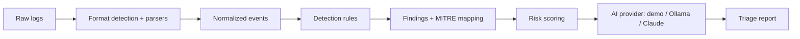

# TriageLens

> AI-assisted SOC alert and log triage. Paste raw security logs, get a parsed, scored, MITRE ATT&CK-mapped triage report with analyst-style recommendations.

TriageLens is a real log-analysis engine with an AI layer on top, not a chatbot wrapped around a prompt. The engine does the detection work in plain, testable code: it parses logs, maps activity to MITRE ATT&CK, and scores risk. The AI layer turns those structured findings into a readable summary, per-finding notes, and prioritized next steps, the way a Tier 1 analyst would write up an alert.

It runs out of the box with **zero setup and no API key** using a built-in rule-based provider, and upgrades to richer analysis with either a **local model (Ollama)** or **Claude**.

## Why this exists

Tier 1 SOC work is mostly triage: read an alert, figure out what happened, decide whether it matters, and write it up. TriageLens models that loop end to end and shows the reasoning instead of hiding it behind a model call. The structured detections are auditable, the MITRE mappings are explicit, and the AI only adds the prose.

## Features

- **Multi-format parsing** that normalizes Windows Security (4688), Sysmon (Event 1), Linux SSH `auth.log`, and arbitrary JSON into a single event model.
- **Rule-based detections** for common attacker behavior (encoded PowerShell, malicious-document chains, LOLBins, execution from temp directories, log clearing, SSH brute force, and post-brute-force compromise).
- **MITRE ATT&CK mapping** with clickable technique badges that link to attack.mitre.org.
- **Composite risk scoring** (0-100) plus an overall severity.
- **Pluggable AI providers**: a no-setup demo provider, a local Ollama provider (logs never leave your machine), and a Claude provider via a serverless proxy.
- **Sample logs** built in, so the report works the moment you open it.

## How it works



Parsing, detection, and scoring are deterministic and provider-independent. Only the final narrative comes from the selected AI provider, so the structured result is identical no matter which provider you pick.

## Quick start

```bash
npm install
npm run dev
```

Open the local URL Vite prints. A sample log is preloaded, so just click **Analyze**. The default **Demo** provider needs no API key.

## Analysis providers

| Provider | Setup | Data leaves machine | Notes |
| --- | --- | --- | --- |
| **Demo** (default) | None | No | Rule-based summary and notes. Always available. |
| **Ollama** (local) | Install [Ollama](https://ollama.com), `ollama pull llama3.1`, set URL/model in Provider setup | No | Private, free, model-generated analysis on your hardware. |
| **Claude** (cloud) | Server `ANTHROPIC_API_KEY` or a key in Provider setup; run with `netlify dev` | Yes | Highest-quality narrative. Key via server env or the in-app setup panel. |

### In-app provider setup

Click **Provider setup** in the header to configure providers without editing env files. Settings are saved in your browser (localStorage).

- **Ollama**: set the base URL and model, then use **Test connection** to confirm Ollama is reachable and the model is pulled.
- **Claude**: optionally paste an API key and pick a model, or leave the key blank to use the server-side key.

### Using the Claude provider

Claude runs through a serverless function (`netlify/functions/analyze.mjs`), so it needs `netlify dev` locally or a Netlify deploy. There are two ways to supply the key:

- **Server key (recommended for deploys).** Set `ANTHROPIC_API_KEY` in the environment. The browser never sees it.

  ```bash
  cp .env.example .env
  # add your ANTHROPIC_API_KEY to .env
  npm i -g netlify-cli
  netlify dev
  ```

- **Bring-your-own-key (handy for a shared demo).** Enter a key in Provider setup. It is stored only in your browser and forwarded to the function over HTTPS, never committed, so others can try your live demo with their own key.

## Supported log formats

| Format | Example | How it is detected |
| --- | --- | --- |
| Windows Security JSON | 4688 process creation | `Provider` contains "Security-Auditing" or `EventID` 4688 |
| Sysmon JSON | Event ID 1 process create | `Provider` contains "Sysmon" |
| Linux SSH `auth.log` | `Failed password ... from <ip>` | syslog `sshd` lines |
| Generic JSON | SIEM / shipper exports | any other JSON object or array |

Paste a single object or an array of records. Windows and Sysmon samples follow the common `Get-WinEvent | ConvertTo-Json` shape (a `Provider`, `EventID`, `Computer`, and `EventData` block).

## Detection rules and MITRE ATT&CK coverage

| Rule | Severity | Techniques |
| --- | --- | --- |
| Obfuscated or encoded PowerShell | High | T1059.001, T1027 |
| Office application spawned a child process | High | T1566.001, T1204.002 |
| Living-off-the-land binary executed | Medium | T1218, T1105 |
| Process executed from a temporary directory | Medium | T1059 |
| Windows event logs cleared | High | T1070.001 |
| SSH brute-force attempt | High | T1110 |
| Successful login after brute-force activity | Critical | T1110, T1078 |

Rules live in [`src/lib/detections/rules.ts`](src/lib/detections/rules.ts) as plain, unit-tested functions. Adding a rule is a small, self-contained change.

## Project structure

```
src/
  lib/
    parsers/      format detection and per-source parsers
    detections/   detection rules and the rule runner
    mitre/        curated ATT&CK technique map
    llm/          provider interface + demo, ollama, anthropic
    risk.ts       composite scoring
    analyze.ts    the full parse -> detect -> score -> enrich pipeline
  components/     React UI (input, report, findings, badges)
  data/           built-in sample logs
netlify/functions/analyze.mjs   serverless proxy for the Claude provider
```

## Scripts

```bash
npm run dev        # start the dev server
npm run build      # production build
npm run typecheck  # tsc --noEmit
npm run lint       # eslint
npm test           # vitest run
```

## Roadmap

- [ ] Native `.evtx` binary parsing (currently expects EVTX exported to JSON)
- [ ] More detection rules (scheduled tasks, service creation, DCSync, suspicious parent chains)
- [ ] Sigma rule import so detections can be authored in a standard format
- [ ] IOC extraction and enrichment (hashes, IPs, domains)
- [ ] Exportable incident report (Markdown / PDF)
- [ ] Batch mode for analyzing multiple files

## Security and scope notes

- TriageLens is an analyst aid and a learning project, not a production SIEM. It does not replace tuned detection content or human judgment.
- Analysis runs locally in the Demo and Ollama providers; nothing is sent anywhere. The Claude provider sends event data to the Anthropic API through your own serverless function.
- The tool only reads and analyzes log text. It never executes anything from the logs it parses.

## License

[MIT](LICENSE)
